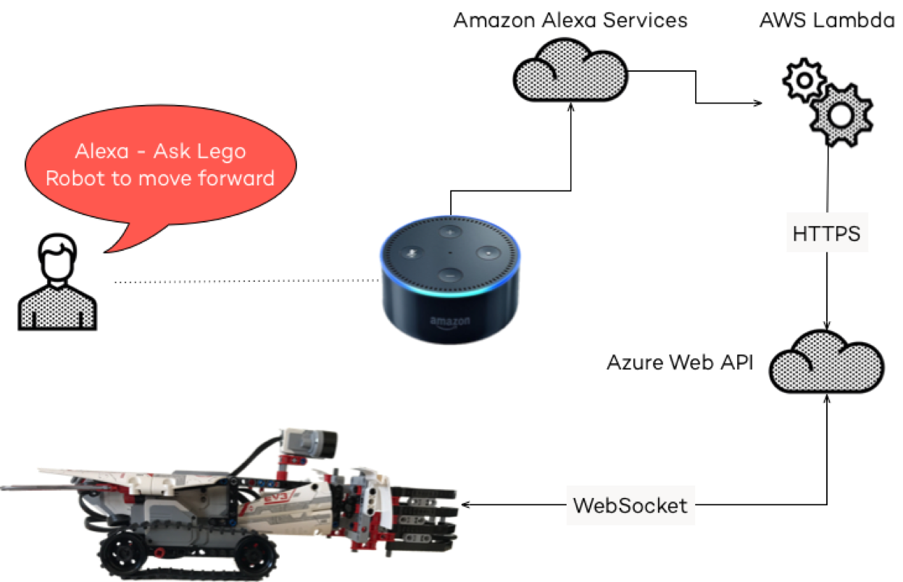

# Simple Amazon Alexa skill for remote controlling a LEGO Mindstorms EV3 - with experimental support for controlling Minecraft

This repository contains the code for the API Bridge, Alexa Skill and EV3 program. 
For more in-depth information, please take a look at this blog post by our friend Manuel Rauber: [https://manuel-rauber.com/2017/05/30/alexa-start-lego-robot-connecting-amazon-alexa-to-lego-mindstorms-ev3/](https://manuel-rauber.com/2017/05/30/alexa-start-lego-robot-connecting-amazon-alexa-to-lego-mindstorms-ev3/)

## Architecture

The following image describes the architecture used to use Alexa to command an EV3 robot.

## API Bridge

The [API Bridge](azure-api) is currently hosted on Azure, but can run anywhere, where Node.js and WebSockets are available. 
It is used to translate HTTP(S) Web API calls, which are sent from the Alexa Skill, into WebSocket commands (currently done via [Socket.io](https://socket.io) v1) which are sent to the EV3 robot. The following APIs are exposed:

* `claw/open`: Opens the claw.
* `claw/close`: Closes the claw.
* `move/forward`: Indefinitely moves forward, until a `move/stop` command is issued.
* `move/backward`:  Indefinitely moves backward, until a `move/stop` command is issued.
* `move/stop`: Stops the robot.
* `doitdude`: Runs a predefined program to grab some beer in front of the robot.

## Alexa Skill

The [Alexa Skill](alexa-skill) uses a Lambda Function running Node.js 6.10. It is acticated by the `Fern Steuerung` phrase.

The following [intents](alexa-skill/intents.json) (currently only in German) are available:

* `ClawIntent`: Can open and close the claw.
	* Voice Command: `Zange {ClawOperation}` with the following `ClawOperation`s:
		* `schließen`: Closes the claw.
		* `öffnen`: Opens the claw.
* `MoveIntent`: Can move the robot.
	* Voice Command: `Bewege {MoveOperation}` with the following `MoveOperation`s:
		* `vorwärts`: Moves the robot forwards.
		* `rückwärts`: Moves the robot backwards.
* `StopIntent`: Stops any movement.
	* Voice Command: `halt`.
* `DoItDudeIntent`: Runs the predefined program.
	* Voice Command: `hop`.

All intents call the appropriate API rather then calling the function on the robot directly. By that architecture, the business logic has been moved to the API bridge, allowing more custom integration scenarios - like the one shown with Minecraft.

## EV3 Program

The [EV3 program](ev3-python) has been written in Python by using the [ev3dev](http://www.ev3dev.org/) operating system. 
The program opens a WebSocket or HTTP Long Polling connection to the API Bridge which is used for communication. 
